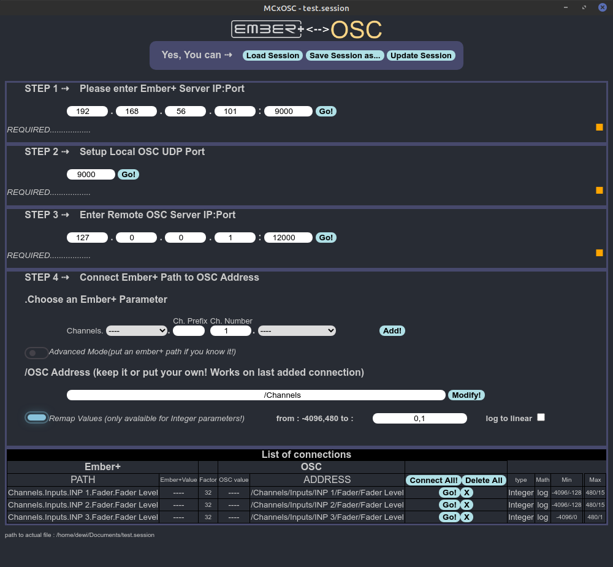

# MCxOSC
An Electron App as Bridge between Ember+ and OSC dedicated to MCx Lawo consoles(not already tested with other ember+ providers)
Based on https://github.com/nrkno/tv-automation-emberplus-connection
(emberLib folder contains a build of 0.0.2 version)
"WORK-IN-PROGRESS!"

# ToDo
- [ ] Test with other ember+ providers (riedel mediornet...)
- [ ] Build for other platform
and much, much more...
