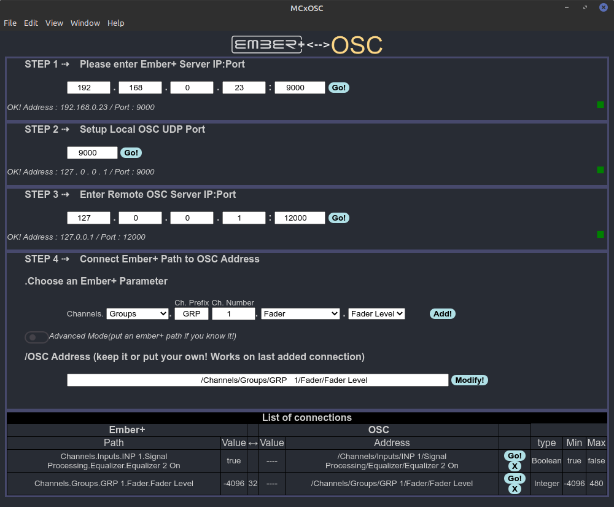

# MCxOSC
An Electron App as Bridge between Ember+ and OSC dedicated to MCx Lawo consoles
Based on https://github.com/nrkno/tv-automation-emberplus-connection
"WORK-IN-PROGRESS!"

# ToDo
- [ ] Enable data persistency
- [ ] Enable frame free window
- [ ] Add Menu Bar
- [ ] Add Menu (Load,Save As,Save)
- [ ] Build for other platform
and much, much more...
